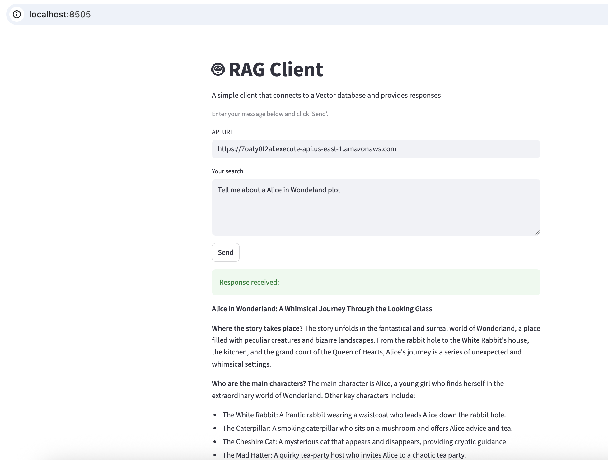
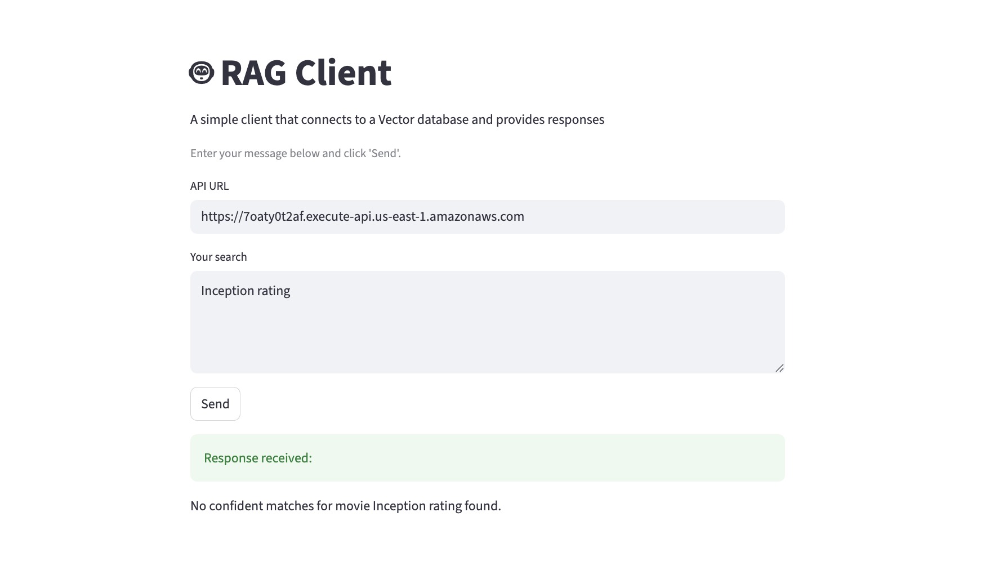
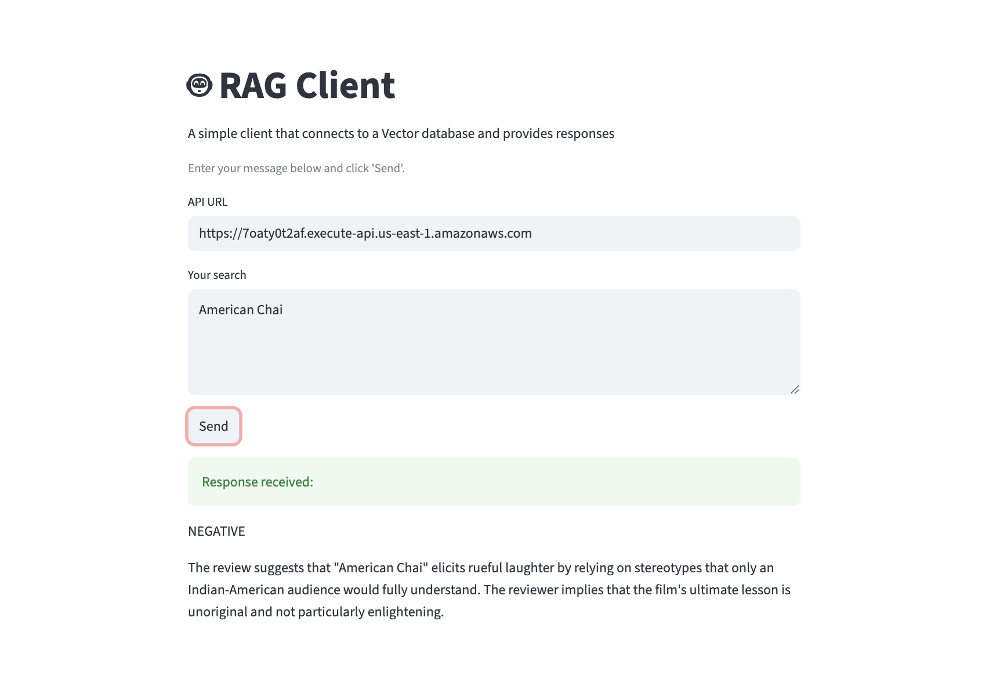
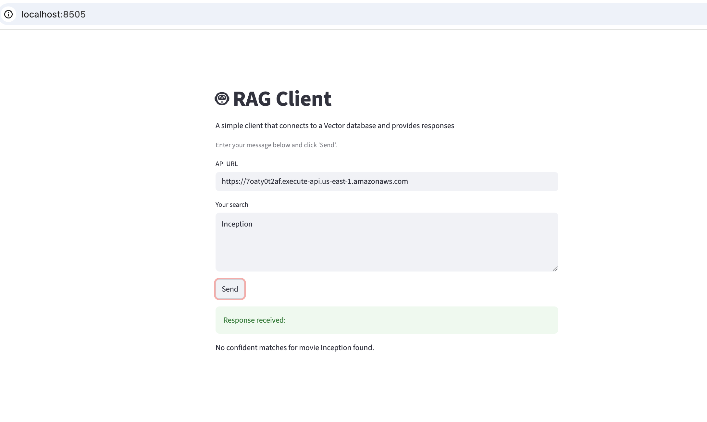

# RAG (Retrieval-Augmented Generation) with Pinecone and AWS Bedrock

## 1. Objective
Demonstrate a **production-ready RAG implementation** that:
- Ingests **movie plots and reviews** into a **Pinecone vector database**
- Uses **AWS Bedrock** for both **embeddings (Titan v2)** and **text generation (Nova Micro)**
- **Automatically selects namespaces** (`movies` vs `reviews`) based on query similarity
- Provides **contextual, LLM-driven responses** via a **Streamlit web interface**

> 🧠 This project serves as a hands-on example of multi-domain RAG pipelines using serverless infrastructure and modern AWS AI models.

---

## 2. Approach

### Architecture Components

| Component | Description |
|------------|--------------|
| **Data Sources** | Movie plots and user reviews from Hugging Face datasets |
| **Vector Database** | Pinecone with namespace separation (`movies` vs `reviews`) |
| **Embeddings** | Amazon Titan Embed Text v2 (1024 dimensions) |
| **LLM** | Amazon Nova Micro (text generation) |
| **Infrastructure** | AWS CDK (Python) automates all resource provisioning |
| **Client** | Streamlit web app for interactive querying |

### Namespace Strategy

| Namespace | Content | Purpose |
|------------|----------|----------|
| **movies** | Movie titles and plot summaries | Retrieve storylines and character-driven context |
| **reviews** | User reviews and sentiment | Retrieve public opinion and ratings |
| **Smart Routing** | Query embeddings decide namespace | Ensures accurate retrieval per query intent |

> The router dynamically computes embedding similarity against “namespace descriptors,” allowing the model to self-select the relevant knowledge base.

---

## 3. Data Sources

### Movies Dataset
- **Source:** `vishnupriyavr/wiki-movie-plots-with-summaries`
- **Content:** Movie titles and plot summaries
- **Processing:** Truncated to 8000 characters per plot for token control
- **Usage:** Ideal for summarization and narrative-style queries

### Reviews Dataset
- **Source:** `rotten_tomatoes` (train/validation/test splits)
- **Content:** User reviews with sentiment (positive/negative/neutral)
- **Processing:** Shuffled, labeled, and normalized text
- **Usage:** Ideal for sentiment analysis and opinion aggregation

---

## 4. Implementation

### Prerequisites
Before deployment, ensure you have:
- AWS account with Bedrock access (Nova Micro + Titan Embed)
- Pinecone account with API key
- Python 3.11+, pip, and Node.js
- AWS CLI configured (`aws configure`)
- AWS CDK v2 installed globally (`npm install -g aws-cdk`)

---

### Key Code Snippets

#### Data Ingestion (`pinecone_ingest/handler.py`)
```python
def lambda_handler(event, context):
    movie_records = _get_records(DATA_BUCKET_NAME, "movies.jsonl")
    review_records = _get_records(DATA_BUCKET_NAME, "reviews.jsonl")
    
    pc = pinecone(api_key=pinecone_api_key)
    if not pc.has_index("rag-index"):
        pc.create_index(
            name="rag-index",
            spec=ServerlessSpec(cloud="aws", region="us-east-1"),
            dimension=1024,
            metric="cosine"
        )
    
    _upsert_records_by_namespace(index, movie_records)   # movies namespace
    _upsert_records_by_namespace(index, review_records)  # reviews namespace
```
Note that the dimensions are created with 1024. For search, it should also use 1024 for dimensions. 

#### Embedding Generation with Titan v2
```python
def titan_v2_embed(texts, dims=1024, normalize=True):
    embeddings = []
    for text in texts:
        body = {"inputText": text, "dimensions": dims, "normalize": normalize}
        response = bedrock.invoke_model(
            modelId="amazon.titan-embed-text-v2:0",
            contentType="application/json",
            accept="application/json",
            body=json.dumps(body)
        )
        payload = json.loads(response["body"].read())
        embeddings.append(payload.get("embedding", []))
    return embeddings
```

#### Smart Namespace Selection (`search_client/handler.py`)
```python
# Pre-computed namespace embeddings for routing
NAMESPACE_DESCRIPTORS = {
    "movies": "Contains names of movies and the plot of the movie",
    "reviews": "Contains user provided reviews for a movie"
}

# Cold start: embed descriptors once
NAMESPACE_EMBEDS = embed_descriptors(NAMESPACE_DESCRIPTORS)

def pick_namespace_for_query(query_text: str) -> str:
    """Route query to most similar namespace using cosine similarity"""
    q_vec = titan_embed_one(query_text, dims=1024, normalize=True)
    best_ns, best_score = "", float("-inf")
    for ns, vec in NAMESPACE_EMBEDS.items():
        score = dot(q_vec, vec)  # cosine similarity (vectors are normalized)
        if score > best_score:
            best_ns, best_score = ns, score
    return best_ns
```

#### Context-Aware Response Generation
```python
def lambda_handler(event, context):
    query = body.get('message')
    
    # 1. Route to appropriate namespace
    namespace = pick_namespace_for_query(query)
    
    # 2. Search Pinecone with similarity threshold
    matches = pinecone_query_by_namespace(namespace, query, top_k=5)
    matches = [m for m in matches if m.score >= 0.30]  # Filter low confidence
    
    # 3. Generate contextual system prompt based on namespace
    if namespace == "movies":
        system = "You are a story teller providing movie plot summaries..."
    else:
        system = "You are a helpful assistant providing movie review analysis..."
    
    # 4. Generate response with Nova Micro
    response = bedrock.converse(
        modelId="amazon.nova-micro-v1:0",
        system=[{'text': system}],
        messages=[{'role': 'user', 'content': [{'text': prompt}]}],
        inferenceConfig={'maxTokens': 1024, 'temperature': 0.3}
    )
```

## 5. Setup and Deployment

### Step 1: Environment Setup
```bash
# Navigate to project directory
cd ./genai-examples/rag

# Install project dependencies
pip install -r requirements.txt

# Install additional dependencies for data fetching
pip install datasets python-dotenv
```

### Step 2: Configure Pinecone API Key
```bash
# Create .env file in project root with your Pinecone API key
echo "PINECONE_API_KEY=your-actual-api-key-here" > .env

# Verify .env file was created
cat .env
```

### Step 3: Generate Sample Data
```bash
# Create data directory and fetch datasets
mkdir -p data

# Download movie plots (10 samples)
python scripts/fetch_movies.py

# Download movie reviews (10 samples) 
python scripts/fetch_reviews.py

# Verify data files were created
ls -la data/
# Expected output: movies.jsonl (movie plots), reviews.jsonl (user reviews)

# Check sample data format
head -1 data/movies.jsonl
head -1 data/reviews.jsonl
```

Expected output:

movies.jsonl: Contains movie titles and plot summaries

reviews.jsonl: Contains user reviews and sentiment labels

### Step 4: Deploy AWS Infrastructure
```bash
# Navigate to root directory
cd rag

# Install CDK dependencies (includes python-dotenv for .env loading)
pip install aws-cdk-lib constructs python-dotenv

# Bootstrap CDK (first time only per account/region)
cdk bootstrap

# Deploy Pinecone infrastructure stack (creates S3 bucket, uploads data, triggers ingestion) and client stack
cdk deploy --all --profile $AWS_PROFILE --require-approval never

# Get API Gateway endpoint from stack output
aws cloudformation describe-stacks \
  --stack-name ClientStack \
  --query "Stacks[0].Outputs[?OutputKey=='ApiEndpoint'].OutputValue" \
  --output text
```

### Step 5: Configure and Run Streamlit Client
```bash
# Navigate to client directory
cd ../client

# Install Streamlit dependencies
pip install -r requirements.txt

# Update app.py with your API Gateway URL
# Edit client/app.py and replace the API_URL value:
# API_URL = "https://your-api-id.execute-api.us-east-1.amazonaws.com"

# Run Streamlit application
streamlit run app.py

# Application will open at http://localhost:8501
```

### Step 6: Verify Deployment
```bash
# Check Pinecone index was created and populated
aws logs describe-log-groups --log-group-name-prefix "/aws/lambda/PineconeIndexStack"

# Test API endpoint directly
curl -X POST "https://your-api-id.execute-api.us-east-1.amazonaws.com/rag" \
  -H "Content-Type: application/json" \
  -d '{"message": "Tell me about a movie plot"}'
```

### Step 7: Test the Application
Open `http://localhost:8501` in your browser and test with these queries:

## 6. Testing Examples

### Movie Plot Queries (Routes to "movies" namespace)
#### Data found for movie in database


#### Data not found in database for movie


### Review Sentiment Queries (Routes to "reviews" namespace)
#### Data found for movie in database


#### Data not found in database for movie


### Debugging Tips
- Check CloudWatch logs for Lambda functions to see namespace routing decisions
- Verify Pinecone index has data: `index.describe_index_stats()` should show non-zero vector counts
- Test API directly with curl before using Streamlit client
- Ensure Bedrock model access is enabled for Titan Embed and Nova Micro

## 7. Cleanup
```bash
# Navigate to root directory
cd rag

# Clean up Pinecone index first (removes data from Pinecone)
python ./infrastructure/cleanup_pinecone.py

# Destroy AWS stacks
cdk destroy --all --profile $AWS_PROFILE --require-approval never

# Verify all resources are removed
aws cloudformation list-stacks --stack-status-filter DELETE_COMPLETE
```

## 8. Project Structure
```
rag/
├── client/                    # Streamlit web interface
│   ├── app.py                # Main Streamlit application
│   └── requirements.txt      # Streamlit + requests dependencies
├── data/                     # Generated datasets (created by scripts)
│   ├── movies.jsonl          # Movie plots from Hugging Face
│   └── reviews.jsonl         # Movie reviews from Rotten Tomatoes
├── infrastructure/           # AWS CDK deployment code
│   ├── stacks/              # CDK stack definitions
│   │   ├── client_stack.py  # API Gateway + Search Lambda
│   │   └── pinecone_index_stack.py # S3 + Ingestion Lambda + Secrets
│   ├── app.py               # CDK app entry point (loads .env)
│   └── cleanup_pinecone.py  # Cleanup script for Pinecone index
├── scripts/                 # Data generation scripts
│   ├── fetch_movies.py      # Downloads movie plots dataset
│   └── fetch_reviews.py     # Downloads movie reviews dataset
├── src/lambda/              # Lambda function implementations
│   ├── deps_layer/          # Shared dependencies layer
│   │   └── requirements.txt # Pinecone SDK
│   ├── pinecone_ingest/     # Data ingestion Lambda
│   │   └── handler.py       # Embeds data and uploads to Pinecone
│   └── search_client/       # Search and response Lambda
│       └── handler.py       # Handles queries, searches Pinecone, generates responses
├── .env                     # Pinecone API key (create this file)
├── cdk.json                 # CDK configuration
└── requirements.txt         # CDK and data processing dependencies
```

## 9. How It Works

### Data Flow
1. **Data Generation**: Scripts fetch movie plots and reviews from Hugging Face datasets
2. **Infrastructure Deployment**: CDK creates S3 bucket, uploads data, deploys Lambda functions
3. **Automatic Ingestion**: S3 upload triggers Lambda that embeds data and stores in Pinecone namespaces
4. **Query Processing**: Client sends query → API Gateway → Lambda determines namespace → searches Pinecone → generates contextual response

### Namespace Routing Logic
- Query "What's the plot of Inception?" → High similarity to "movies" descriptor → Searches movies namespace
- Query "What do people think about this movie?" → High similarity to "reviews" descriptor → Searches reviews namespace

### Response Customization
- **Movies namespace**: Generates plot summaries with characters, setting, and conflicts
- **Reviews namespace**: Provides sentiment analysis and rating insights

This implementation demonstrates a RAG system with intelligent namespace routing, automatic data ingestion, and context-aware response generation suitable for multi-domain question answering scenarios.